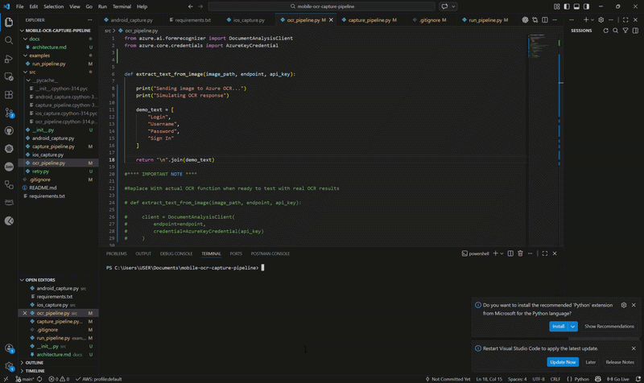

# Mobile OCR Capture Pipeline

This project implements a cross-platform mobile screen capture pipeline that extracts text using Azure AI Document Intelligence.

Features

• Android screen capture using ADB
• iOS screen capture using libimobiledevice
• OCR integration using Azure Document Intelligence
• Cross-platform capture pipeline
• Logging and error handling

Requirements

Python 3.8+

Install dependencies:

pip install -r requirements.txt

Android Setup

Install ADB and connect your Android device.

iOS Setup

Install libimobiledevice:

brew install libimobiledevice

Verify device connection:

idevice_id -l

Running the pipeline

python examples/run_pipeline.py

## Demo

Android screenshot → OCR extraction pipeline.

